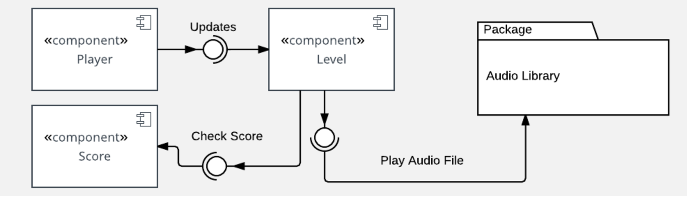
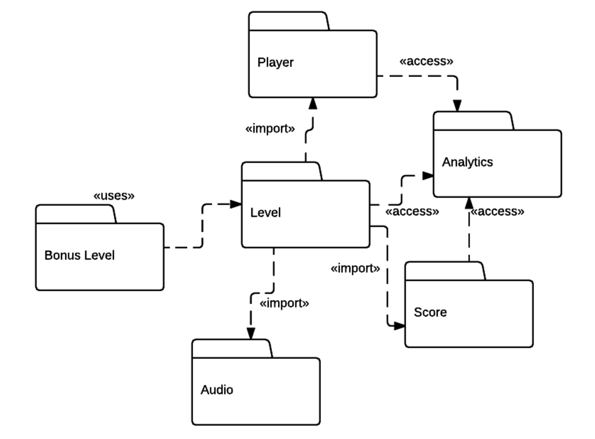
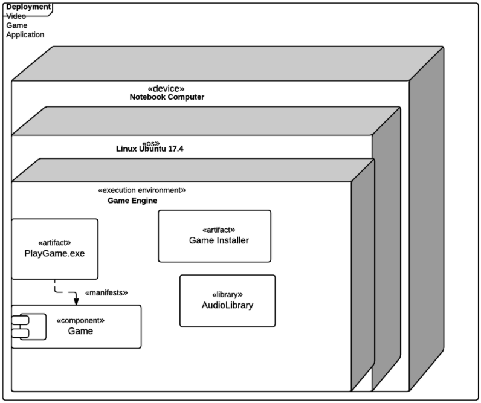
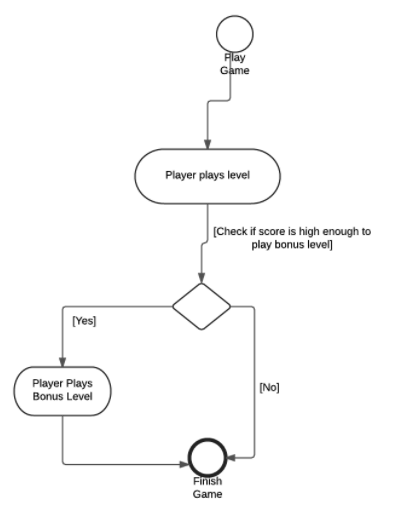

# UML Architecture Diagrams

## Architecture Overview and Process

## Communicating Architecture

### Kructhen's 4 + 1 Model View

The four views correspond to the key perspectives that go into architecting a software solution. The various views are not fully independent of each other with elements of some views connected to others. Not all software architectures need to be documented using the four plus one view model. If any of the views is thought to be useless they can be omitted

#### Logical View

- **Functional requirements** of a system.
- A UML class diagram that illustrates the logical view.
- A UML State Diagram behaviour of object and classes

#### Process View 
- **Nonfunctional requirements** which specify the desired qualities for the system.
- Include quality attributes such as performance and availability.
- Processes that correspond to the objects in a logical view. 
- A UML sequence diagram illustrating the methods, how they are executed and in what order.
- A UML activity diagram can illustrate the processes or activities for a system.

#### Development View
- Describes the hierarchical software structure. 
- Considers elements like programming languages, libraries and tool sets. 
- Details of software development and what is involved to support that. Besides code, this includes project management details like scheduling, budgets and work assignments.

#### Physical View
- Handles how elements in the logical process, and development views must be mapped to different nodes or hardware for running the system.
- A UML deployment diagram can express how the pieces of a system are deployed into hardware or execution environments.

### UML Component Diagram
UML component diagrams are concerned with the components of a system. Components are defined as independent, encapsulated units within a system. Each component provides an interface for other components to interact with it. 

Component diagrams are used to visualize how a system's pieces interact and what relationships they have among them. They are about high-level structure and not about details like attributes and methods. They are purely about components and how they interact with one another.

#### Ball Connector
The basis of component diagrams are components and their relationships. Each component in a diagram has a very specific relationship to the other component through the interface it provides. The **ball connector** display a provided interface in component diagrams. 

#### Socket Connector
The purpose of a provided interface is to show that a component offers an interface for others to interact with it. Provided interface means that client and consumer components have a way of communicating with that component. The **socket connector** displays a required interface. The required interface is essential to the component diagram to show that a component expects a certain interface provided by some other component to be able to achieve its responsibilities. 

#### Assembly Relationship
In a component diagram, an assembly relationship is where one component's provided interface matches another component's required interface. The provided interface is depicted by a ball, and the required interface is depicted by a socket. 

### UML Package Diagram
A package groups together elements of your software that are related. This elements can be related based on **data**, **classes** or **user tasks**, for example. A package also defines a **namespace** for the elements it contains, that is, a package is named, and can organize the named elements of your software into a separate scope.

An element can be uniquely identified in the system by a fully **qualified name**, based on its own name, and the name of the package that the element is in. Package diagrams show packages and the dependencies between them. 

A package can import an element from another package. A package can import the entire
contents of other packages. And packages can be merged. 

### UML Deployment Diagram
UML deployment diagram shows the deployment details for a software system. The deployment environment or deployment target can be very specific involving particular hardware devices or fairly general, involving supported operating systems. The result of the development process is called **artifact**. 

#### Specification level diagram
A specification level diagram gives an overview of artifacts and deployment targets, without referencing specific details like machine names. It focuses on a general overview of your deployment rather than the specifics.

#### Instance level diagram 
A instance level diagram is a much more specific approach, which can map a specific artifact to a specific deployment target. In particular, the instance level diagram can identify specific machines and hardware devices. Most commonly, this approach is used to highlight the differences in deployments among development, staging, and release builds. 

#### Nodes
Nodes are deployment targets that contain artifacts available for execution. They look like 3D boxes. Hardware devices are also displayed in the same way as nodes. The device tag on this node differentiates it from other types of nodes. 

When an artifact is deployed to a node, the diagram depicts this dependency by drawing the artifact inside the node box. This also means the artifact cannot function without this deployment target. Manifestation is shown in the manifests relationship here, where an artifact is a physical realization of a software component. 

### UML Activity Diagram
A UML activity diagram represent the control flow from one activity to another in a software system. The purpose of the activity diagram is to capture the dynamic behavior of the system. How control flows from one activity to another. 

The activity diagram allows you to map out the branching into alternative flows. When you are creating an activity diagram, you will first need to identify the **activities**. These are the actions performed by the system.

The start and end **nodes**, denoted by labeled circles, are where you must begin your diagram. They show the starting activity that initializes the control flow of the application. The end node shows the final activity of the diagram. 

The **intermediate activities** are shaped in the same way as a pill. They describe all of the activities that change the application state before the application ends. 

There is a decision node. Which has an activity leading into it, and the possibility of two alternative outcomes as the next activity. The choice of outcome depends on how the
condition on the decision node evaluates. 

You can also map out concurrent activities that happen in parallel. Parallel flows can join into a single flow. One of the main ways concurrent activities are shown in an activity diagram is via **partitions**. 

Partitions divide activities up into different categories, such as where it occurs, or the user role involved. Swim lanes are used in an activity diagram to display these partitions. 

