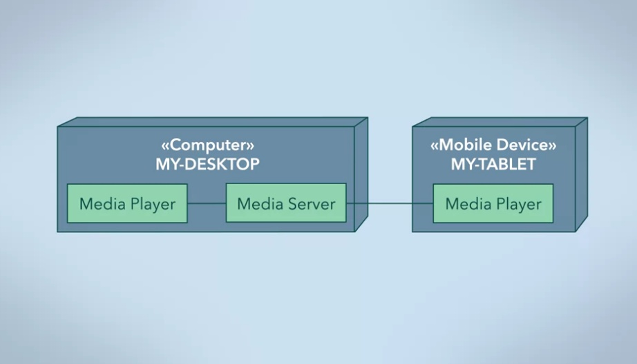

# Architectural Styles

## Language-based Systems

### Abstract Data Type

The programming paradigm of the language used to implement the system will affect the architectural style of that system. Each programming paradigm has its own set of constructs and their use will shape the system you create.

There are many different styles of language-based architecture systems. The object-oriented architectural style results from the object-oriented programming paradigm. When you're choosing to develop a project using an object-oriented language, such as Java or C++, you're not simply choosing a language. Object-oriented principles, constructs, and design problems are all part of the whole deal.

### Main Program and Subroutine

The main program and subroutine architectural style that follows from the procedural programming paradigm. C is a language that follows this paradigm.

Main program and subroutine is a style that is fundamentally focused on functions. When presented with a system to model, you break up the overall functionality of the system into a main program and subroutines. In nested calls, subroutines may call other subroutines, which may call other subroutines, and so on.

The structure of the subroutines that build up the system affect the structure of the system as a whole. Essentially, the subroutines, as declared in the code, are structured as a big **call tree**.

Data in this paradigm is stored as variables. **Inheritance is not explicitly supported**. **Your main consideration is the behavior of functions and how data moves through them**. 

This approach is suitable for computation-focused systems. Each subroutine may have its own local variables. A subroutine has access to all data within its scope. To give a subroutine access to data outside its scope, data may be passed into the subroutine as parameters, by value or by reference. And data may be passed out of a subroutine as a return value.

A principle that arise from this paradigm is **one entry, one exit per subroutine**, which makes the control flow of the subroutine easier to follow. This architectural style promotes modularity and function reuse. When your functions are well defined, you can think of them as **black boxes**.

A potential issue with this approach is that subroutines may mutate data in unexpected ways. **A subroutine may be affected by data changes made by another subroutine during execution.** This issue is especially true for global data shared across subroutines. These changes to data can be unpredictable and results in a function receiving an input that it was not expecting, or even an input that it is not capable of handling correctly, which can result in runtime errors.

## Repository-based System
### Databases

A data centric software architecture allow to store and share data between multiple components, increase the maintainability, re-usability and scalability of the system. 

At the core of a data centric architecture are two types of components:
- **Central data** used to store and serve data across all components that connect to it, and
- **Data accessors** connects to the central data component. The data accessors make queries and transactions against the information stored in the database.

A **database** is commonly used to store data because it ensures several data qualities. The two key ones for a data centric architecture are:
- **Data integrity**, ensure the data is accurate and consistent over its lifespan. This is important if you want to have reliable data, and
- **Data persistence** that data will continue to live on after a process has been terminated.

**Relational database**s are a type of database that uses tables. Each table represents an abstraction. Relational databases use SQL or **Structured Query Language** to let you **query** or ask the database for information and lets you **perform transactions** or tell a database to do something.

The central data is primarily concerned with storing and serving the information. A data accessor is essentially any component that connects to the database:
- **Share a set of data** while being able to operate independently.
- **Communicate with the database** through database queries and transactions.
- **Query the database to obtain shared system information**. This is used to get data in order to perform computations.
- **Save the new state of the system back** into the database using transactions. Data is stored back into the database once the data accessor has finished its processing.

This architectural design is capable of supporting **data integrity**, **data backup**, and **data restoration through** a database. These features can help with issues like **massive data loss**, **data corruption**, and **data migration**.

## Layered Systems
### Layered Systems

The key characteristic of a layered architecture is that the components in a layer only interact with components in their own layer or adjacent layers. When an upper layer interacts with a layer directly below it, it cannot see any of the deeper layers.

The interfaces provided by the components of layer should be well defined and driven by the needs of the system. Layering allows for **separation of concerns** into each of the layers. Many layered systems are split into **presentation**, **logic**, and **data layers**.

The layered structure can perform complex tasks without understanding the layers below. Another benefit of this structure is that the different layers can be run at different levels of authorization or privilege. The top layer is typically run in what is called the **user space**, which does not have the authority to allocate system resources or communicate with hardware directly. This so-called **sandboxing** improves the security and reliability of the kernel.

By using a layered architecture, your design will be more **loosely coupled**. Layered architecture follows the principle of least knowledge. Each layer only interacts directly with adjacent layers. Lower layers typically provide services to the layer above.

Enforcing layers also has an efficiency tradeoff. If you enforce the rule that only adjacent layers can communicate, then any real system will have some interactions that are simply passed through one layer to the next.

From a software perspective, this extra communication adds complexity and uses processing resources. You have to balance this **overhead** against the **separation of responsibilities** gained from enforcing layers. The layered architecture can be relaxed by allowing for pass-through. However, this makes for tighter coupling in your software.

**Why use layered architecture?**
Layered systems are an intuitive and powerful architecture.
Many organizations and solutions have a layered structure.

Layering allows for **separation of concerns**. Each layer is actually a set of components, but with similar responsibility or purpose. Since each layer communicates with only one or two other layers, different implementations of a layer can be swapped easily because layering encourages **modular loosely coupled code**. Layers are easily mapped to organize a solution to many problems. Even when a pure layered architecture is not used in the end product, it can be **adapted** to help manage the design complexity or serve as a starting point for structuring the system.

### Client Server n-Tier
n-Tier, also called called Multitier. Tiers often refer to components that are on different physical machines. So this architecture is called n-Tier or a Multitier.

The relationship between 2-Tiers in an n-Tier architecture is often a **client/server relationship**. The **server** side provides services. This could be storing information in a database, performing computation tasks, any sort of service. The **client** side requests these services through messages. The communication between the two sides is called **Request-Response**, and it works in exactly the way it sounds. **The client requests information or actions, and the server responds**.

A tier can act as both a server and a client, simultaneously fulfilling the requests of its clients and making requests of its servers.

The server process does not know how many clients it may have, you can add more clients as you need to.

Even though the server and client processes are on  they can run on the same machine. Instead of having a dedicated computer for your media server. The terms **Client-Host** and **Server-Host** refer to machines that host the client software and server software, respectively.

The Client-hosts make up the Client Tier, and the media server is the Data Tier.  We can call this a 2-Tier architecture.

A server is usually specified by the type of service it provides.
Types of servers include web servers,application servers, file servers, and print servers.

The diagram illustrates the Request-Response messaging. As a client, a media player first requests to see what the media server has in its library, so the server sends that information back.

After the user makes a selection, the client requests a chosen video from the media server, which starts streaming it. The Request-Response relationship between a client and a server can be synchronous or asynchronous. For a synchronous request and response, the client sends a request, then awaits the server's response before continuing execution. 

**Synchronous** messages are depicted with a closed arrowhead. Although this may be intuitive, servers do not always respond quickly. So a synchronous message may cause the client to hang while waiting for a response.

A **asynchronous** message the client sends a request, but control returns right away so it can continue its processing on another need. None of this processing can depend on the response from the server. Once the server has fulfilled the request, it will send a message to the client, which will have a handler that processes the response. An asynchronous message is depicted in UML with a line arrowhead.

Many client requests are designed to run asynchronously, because generally we like our clients to be responsive for other tasks even if they're waiting for information from the server.

Limiting the Client-Server relationship to a **Request-Response** messaging pattern allows for systems which are easily scalable by adding more clients. Clients and servers are more extensible, because as long as a server receives a message that it knows, it can respond. The source of the message is not important to the server, clients can be added as needed.

A simple Client-Server relationship with one server and one set of clients is also often called a **2-Tier Architecture**. Let's change our example to a business to demonstrate how we can do better. 

Well, hold on, **if the database changes you're going to have to change the software on each and every computer**. Sure, that's not hard for three computers, but even a small business could easily have many computers.

Let's try to make an improvement by inserting a tier in between our data and our end user software. In a **3-Tier architecture**, a tier is inserted between the database and the end users.

A middle layer, a business layer, an application layer. The name depends on its main responsibility. **If it's a client of the database and server for the client application software on the end users' devices.** One of the principle roles of this middle tier is to determine how or when data can be changed and in what ways. By moving this application logic and the data access logic to the middle layer, the client application software is now thinner. This client software makes request to the application tier, which in turn makes data calls. The client software is now mainly concerned with presentation, so it's easier to maintain.

The purpose of these additional tiers is very specific to the system. In the database example above, the application logic could be split into security concerns and database operation concerns. There are a few drawbacks to the n-Tier architecture. It **demands extra resources to manage the client/server relationships**. Adding more tiers means there are more machines or processes to manage.

With different communication protocols between machines, this additional heterogeneity and **complexity makes the system more difficult to change or maintain**.

A server acts as a central point of failure. Many systems have data backups or mirrors, but these can take time to recover or switch. **Redundant servers are possible**, but add complexity.

One of the principle advantages of the 2-Tier client/server architecture is it is very **scalable**. As long as the server can handle all the requests it receives in a reasonable time, more clients can be added and start making requests. By extending this further with an N-Tier architecture, with more tiers, the scalability is incredible.

**Centralizing** functionality on a server has some obvious benefits. Databases that need to be accessed by a number of clients are a natural fit for client/server relationships. In our media server example, the movies and TV shows only have to reside on one machine, but can be accessed by any machine on your network. Computing power can also be centralized. This consolidates investment in computing power. People who do mathematical simulations of complex phenomena often do not have the necessary computing power on their personal computer. Instead, companies exist to provide this processing power as a service, which is more practical and cost effective.

Adding tiers to the client/server relationship can allow you to apply **separation of concerns**. A middle layer can take the role of managing application logic in accessing the database directly. These tasks can even be split up further for more refined needs. Any time a system can be split into service roles and requester roles, a client/server architecture should be considered. Adding tiers to this architecture can allow for more separation of concerns, loose coupling, and levels of abstraction, which result in a system that's easier to change and extend. 

## Interpreters-based System
### Interpreters

A component called an interpreter interpret the input into an intermediate representation. The end user doesn't need to know about the underlying implementation

Systems based on interpreters can allow an end user to write scripts, macros or rules that **access**, **compose**, and **run** the basic features of those systems in new and dynamic ways.

The interpreter-based architecture provides users with **flexible** and **portable** functionality. Interpreters can be used to run **scripts** and **macros**. Systems can use an interpreter to drive programmable actions specified by the user.

An interpreter allows you to **add functionality** to a system, or **extend existing functionality** of a system.

This is done by composing preexisting functions together in a specific sequence in order to create something new. These preexisting functions are defined by the system architecture and offered to the user.

Having a system with a built in interpreter is not only beneficial to developers, it **encourages end users to implement their own customizations**.

The system itself can be implemented in a language that runs upon an interpreter. This can make your system more **portable**. The interpreter and it's environment, essentially, abstracts the underlying platforms, so your system can be more platform independent. Portability is becoming more important with the rise of **virtual machines** and **virtual environments**. With more services being hosted in Cloud, it is becoming increasingly important to be able to develop and deploy software systems onto hardware that you have no control over.

Interpreters can be **slow**. Basic implementation spend little time analyzing the source code and use a line by line translate and execute strategy.

Interpreters support many different uses such as scripting, creation of macros and enabling programs to work across different computer architectures. As a designer, it's important that you understand the role of interpreters in a system's architecture, as they can be used to address needs for programmability, flexibility, and portability. 

### State Transition Systems

- State. The information that a system remembers defines its state. For example, a queue system can be in a number of different "states": an empty state, a queued state, or a full state.

- Transition. A transition is used to describe the change of a system from one state to another. A single system state can have multiple transitions; majority of systems today will have multiple transitions branching from one system state. This makes behaviors non-deterministic, since we cannot predict what the next state of the system will be.

- Behavior. The behavior of a system describes what the system will do when exposed to a condition, which can vary from timed system events to user input.

State transition systems can be labelled or unlabelled.

An unlabelled state transition system is defined as a set of state, S, and transition, →, pairs that are used to describe the system's behavior. If p and q are two different states in S, then the transition between them is depicted by (p → q)

A labelled state transition system simple includes a set of labels, ~, with addition to the state-transition pair. Given the same states p and q in S, then the transition between the two states is shown as (p ⭇ q).

Unlabelled state transitions can be used for systems where the transition between all states are the same. For example, your system could respond to a single button press that simply transitions the system sequentially from one state to the next.

## Dataflow Systems
### Pipes and Filters

Data flow architecture considers a system as simply a series of transformation on sets of data. Data is transformed from one form to another using different types of operations.

A pipe and filter architecture has independent entities called **filters** which perform transformations on data input they receive, and **pipes**, which serve as connectors for the stream of data being transformed.

The data flows in one direction. It starts at a data source, then moves into a series of pipes and filters, and then eventually ends at the data target. The changes to the data are done sequentially from filter to filter. Each pipe serves as a connector for the stream of data. It transmits the output of one filter as input for the next filter. Each filter performs its local transformation on the data input it receives from the previous pipe and then it sends the output onto the next pipe. 

**The order in which the filters transform data may change the end result**. The input of one filter is the output of another. So order is very important.

In the UML component diagram, the data source can be connected to a number of different filters. Each filter has a required interface to receive input from data sources and other filters. But each also have a provided interface that will output transformed data. The data target is connected to receive the fully transformed result.

Advantages to using the pipe and filter architecture:
- It **ensures loose and flexible coupling of components**, the filters. Each filter runs independently of other filters, only focusing on its input and output data, which allows you to easily add newly developed filters or move filters around in a system to achieve different results. Additionally, the loose coupling also allows changes on individual filters to be made easily without affecting other filters in the system.

- **Filters** can be treated as black boxes.
Users of the system do not need to know the inner workings of each filter.
So they can simply use a filter to transform different datasets and
not worry about knowing the logic behind that transformation.

- **Reusability**, each filter can be called and used over and over again with different inputs. Filters can be repeatedly used in different applications for different purposes.

Disvantages to using the pipe and filter architecture: 
- **Reduce performance due to excessive overheads infilters**. For this type of architecture, each filter will receive input, parse that input into some data structure, perform transformations, and then send data out. The next filter will do the same thing, parse the input into a data structure, do transformations, and send data to another filter, which will also do the same thing. If each and every filter has to do this process with similar parsing at output stages, that's a lot of overhead. As more and more filters are added, the performance of the system will rapidly diminish.

- Filters to get **overloaded with massive amounts of data to process**. While one filter is working hard to process the large amount of data, other filters may be starved waiting for their inputs.

- **It cannot be used for interactive applications**. The data transfers and transformations will take time depending on the amount of data transmitted.

## Implicit Invocation System
### Event-Based

Event driven programming paradigm, the fundamental elements in the system are events. Events can be signals, user inputs, messages or a data from other functions or programs. Events act as both indicators of change in the system and as triggers to functions. In this paradigm, functions take the form of event generators and event consumers.

- **Event generators** send events and **event consumers** receive and
process these events. A function can be both an event generator and an event consumer.

Functions are not explicitly called in the event-based architectural style. Instead, event consumers are called implicitly based on event sent from event generators. 

**Event-based functions experience implicit invocation** is that a functions are not in direct communication with each other. All communication between them is mediated by an event bus.

- **Event bus** as the connector between of all event generators and consumers in the system.
  
To achieve this structure, we first bind an event and an event consumer via the event bus. That is, each event consumer registers with the event bus to be notified of certain events. When the event bus detects an event, it distributes the event to all appropriate event consumers. Because all events must pass through the event bus, it is critical part of the system. The observer design pattern actually manifests the event based architectural style.

One way to implement the event bus is to structure the system to **have a main loop
that continually listens for events**. When an event is detected, the loop calls all the functions bound to that event.

In many cases, we will want an event consumer to notify other functions when it has completed its task or to send a state change, so this function must also be an event generator. This function will implicitly invoke other functions to run after it's completed. It does this by sending out an event, the event bus.

All of the indirect communication between functions may not be as efficient as explicit function invocation.

In the event based architectural style, event generators do not necessarily know
which functions will be consuming their events, and likewise, event consumers do not necessarily know who is generating the events they handled. This **loose coupling** of functions makes it easier to evolve and scale the system.

Adding new functionally for an existing event is as simple as registering a new
event function pair to the event bus and adding a new event consumer.

If objects in the system are globally accessible then event consumers may change the shared state as they process an event. This design may be risky because **Event consumers can be called asynchronously**.

With asynchronous calls, an event consumer does not need to wait for other event consumers to finish running before itself running. This means that **two event consumers could be running at the same time on the same
shared data**.

Systems that allow asynchronous function calls may increase the efficiency of the system. But asynchronous calls can result in **race conditions**. Where the shared data may not be updated correctly. A system has race conditions when the behavior of the functions depend on the order in which they are called. One way to coordinate function access to shared data is through a **semaphore**.

Alternatively, if an object is not globally accessible and its state is changed by an event consumer then some indication of this must be sent back to the event bus before the function ends. This way, event consumers to that event will be aware of the state change.

In this architectural style, events and functions do not occur in a predictable way. There are no guarantees of exactly when an event will be handled, how long it will take to be handled, or when an event generator will emit an event. Because of this a synchronize behavior, the control flow is entirely based on which events occurred during its execution and in what order.

### Publish-Subscribe

There are two important differences that differentiate the publish-subscribe architectural style from the event-based architectural style.

First, unlike the the event-based architectural style, the components are either publishers or subscribers. Publishers send messages, while subscribers can subscribe or unsubscribe to receive these messages. A component cannot be both a publisher and a subscriber.

And second, the relationship between the publisher and the subscribers may vary in form and closeness.

Like the event-based architectural style, the publish-subscribe architectural style relies on implicit invocation. Publishers and subscribers are not explicitly connected, but instead, there is a loose coupling between them.

In a simple implementation of the publish-subscribe architectural style, to receive messages, a subscriber registers their interest to publishers through a call-back. Publishers maintain a list of subscribers and communicate to them through procedure calls to the registered call-backs. In this way, subscribers are informed of messages implicitly.

This implementation is well suited to applications where each publisher has a relatively small number of subscribers. Every time a new message is ready to be published, the publisher makes a procedure call to each subscriber to deliver the new message. This can become a lot of work for the publisher as the number of subscribers grows.

Alternatively, the publish-subscribe architectural style can be adapted to deal with large scale applications, where a single publisher may have many subscribers, by designing a system with more loosely coupled components.

This is achieved by introducing a connector to distribute and possibly filter the messages to the subscribers. The connector could be an event bus or a network protocol. The connector creates more distance between publishers and subscribers and relieves work for the publisher. These connectors may provide complex filtering of messages before they are delivered to the subscribers.

If an event bus is used as a connector, the system would be similar to the event-based architectural style, in that subscribers register with the event bus to receive messages from a particular publisher, and the publisher sends messages to the event bus for delivery to its subscribers. Because the event bus mediates communication, publishers may not be aware of the subscribers. However, remember there is an important difference here in the publish-subscribe architectural style, publishers can only send messages, not receive them, and subscribers can only receive messages, not send them.

## Process Control System
### Process Control

**Process control is important in many processes to operate efficiently and safely**. The most basic form of process control is called a **feedback loop**.

A feedback loop has four basic components: 
- **Sensor**: monitors some important information,
- **Controller**: logic,
- **Actuator**: the physical method of manipulationg the process and
- **Process**: what you are trying to control.

