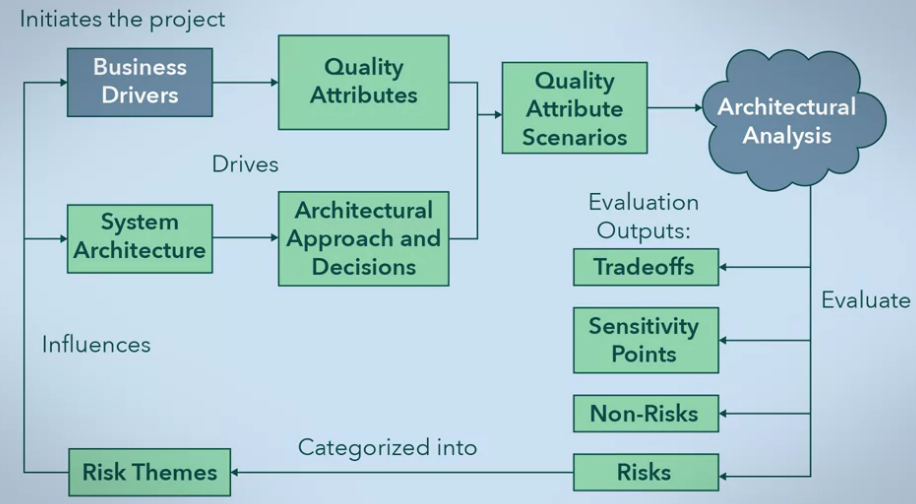

# Architectural in Pratice

## Architectural Trade-Offs

### Quality Attributes
Software architectures are analyzed, evaluated, and how they interact with software development by the questions:
- What makes an architecture good or bad for the given problem?
- How do we identify its quality and identify improvements?
- How can we use architecture to plan development and structure and development team?
- How can we realize opportunities for reuse to reduce costs and increase development efficiency?

Software architecture aims to combine software design patterns and principles in order to define the software's elements, their properties, and how the elements interact with each other.

System architectures are more concerned with **addressing the bigger picture which includes functional and nonfunctional aspects of the system**.

Software architecture addresses the qualities:
- Testability,
- Usability,
- Availability, and
- Coordinating design patterns in order to **construct a unified system**.

The architecture of a system is qualified by how well the entire combination of software elements work together to provide functionality and handle potential system issues. In addition, the architecture is also qualified by how well the design addresses user experience and ease of development.

Software architecture is not inherently good or bad. That is to say that an architectural design doesn't have inherent qualities that make it a good architecture or a bad architecture. Software architecture is designed to address a set of requirements. These requirements are used to address a problem or need.

The **context** in which you are designing is important. A system needs to be able to operate and perform within a given context.

There are **functional and non-functional requirements** to consider when designing the architecture of your system. Non-functional requirements are not always clear or even explicitly presented by your clients or stakeholders.

The development team will care about requirements like **maintainability**, **reusability**, **testability**, and **supportability**. User most care about **ease of use**, **error handling**, **system stability**.

The quality of a system is determined by **quality attributes (DEVELOPER PESPECTIVE)**, **measurable properties of a system used to gauge a system's design, run time performance, and usability**. An emphasis on **maintainability**, **reusability**, and **flexibility** when designing and implementing systems but **more are also possible**.

- **Maintainability** determines how easy systems can undergo change. Your system will undergo many changes throughout its life cycle in order to fix errors, change software elements, add new features, or retire old services.
- **Reusability** allows you to take functionalityor parts from a system and use it in another system. It helps reduce the cost of reimplementing something that has already been done.
- **Flexibility** is a measure of your system's ability to adapt. A highly flexible system is able to adapt to future requirements changes in a timely and cost efficient manner.
- **Modify** ability is closely related to maintainability in that it is a measure of your system's ability to change. This quality attribute **determines the ease at which your system is able to handle changes to functions, incorporate new functionality, or remove existing functions**. The goal of a highly modifiable system is to provide an enhanced experience to the end user by adopting new technologies and industry standards.
- **Testability**, programmatically testing your system for errors is important because they can be done quickly, easily, and do not require a user interface. Testing during implementation will help identify faults so that they can be fixed before you release your system.
- **Conceptual integrity** so that there is consistency throughout the system. This can include consistency in design across subsystems through naming conventions.

The quality of your system will be most dependent on how well it performs: 
- Is it able to meet requirements?
- Is it intuitive to use?
- Does it perform its functionality in a timely manner?
- Are the outputs of the system correct?
- How well can it handle errors?

There are many **quality attributes (USER PESPECTIVE)** to take into consideration when evaluating how well a system performs from a user's perspective.

- **Availability** which is the amount of time the system is operational over a set period of time.
- **Interoperability** is the extent of your system's ability to understand interfaces and use them to exchange information under specific conditions with external systems.
- **Security** of your system is how well your system is protected from unauthorized access and use. Sensitive data should also be readily available only to those with authorization and the system should provide **data integrity**. This means controlling who can see the data versus who can also change the data.
- **Performance** determines how well your system is able to respond to a user command or system event. It is measured by the system's **throughput** and **latency**. Throughput is the amount of output produced over a period of time while latency measures the time it takes to produce an output after receiving an input.
- **Usability** determines how wellyour system is able to address the requirements of the end users.

A high quality system is to
- have detailed and up-to-date documentation.
- being able to create or choose an appropriate architectural design for your system.
- makes maintaining,supporting and updating the system throughout its life cycle much easier.
- does not need to be complex.More often than not, an overly complex system

The process of designing a high quality system architecture should be methodical. You should use a set of rules or guidelines for the design process and how your system will be structured.
- recognizingthe importance of quality attributes and prioritizing them for each system being designed.
- involving a technical lead in the design process.
- taking a design approach from the perspective of different groups of stakeholders, having well-defined subsystems that are assigned responsibilities based on design principles, having consistent implementations of functions across the entire system, having a set of rules on how resources are used.

You should consider involving all groups of stakeholders in the design of your system so that all concerns are heard and addressed, adopting good documentation practices to ensure that the details of your system design are not lost over time, setting rules for design and implementation so that you are able to achieve high standards for your quality attributes.

A properly designed system will consider quality attributes that address the developers' perspective by providing maintainability, reusability, flexibility, modifiability, testability and conceptual integrity; the users' perspective by being available, interoperable, secure, performant and usable.

### Analyzing and Evaluationg an Architecture
How do you actually evaluate your design to determine if it'sable to address the concerns of all your stakeholders? How do we perform the measurement? 

All quality attributes use quality attribute scenarios to determine if a system is able to meet the requirements that are set for the quality attribute.
- **general** scenario is used to characterize any system,
- **concrete** scenario is used to characterize a specific system.

Each scenario consists of a stimulus source, a stimulus, an artifact, an environment, a response, and a response measure.

- **stimulus source** is anything that creates a stimulus, a source can be internal or external to the system.
- **stimulus** is a condition that will cause the system to respond.
- **environment** is the mode of the system when it is receiving a stimulus.
- **artifact** is the part of the system that is affected by the stimulus.In large scale systems, a stimulus should not directly affect the entire system. Instead, a stimulus should cause a response within a sub-system, which then sends a stimulus to another sub-system.
- **response** is how the artifact will behave as a result of receiving a stimulus.
- **response measure** is a metric used to quantify the response, sothat the quality attribute can be measured.

In the context of analyzing and evaluating architecture, you should focus on situations that are outside of the normal execution path. This means that scenarios involving **incorrect input**, **heavy system loads**, or **potential security breaches** should be prioritized highly.

- **inability** to handle unexpected failures.
- **availability** you need to consider the situations that causethe system to become unavailable.
- **recovery time** is an important stimulus response

In a general scenario, you would consider possible high level events and summarize them. Since a single scenario may involve many scenario component values

Concrete scenarios are more focused. This allows you to test an architecture with a specific stimulus under specific system environments, and measure how well the system can respond.

analysis and evaluation of the entire architecture, the Software Engineering Institution at Carnegie Mellon University. Called ATAM, which stands for **Architecture Tradeoff Analysis Method**. The advantage of ATAM is that the evaluators do not need to be familiar with the architecture or the problem space.

ATAM involves three different groups:

- **evaluation team**:
  - **designers** are the ones involved with the architectural design. This group naturally follows an iterative, hypothesis-driven method when designing.
  - **peers**, they are part of the project, butare not involved in the design decisions. This allows you to get different viewpoints on your design decisions.
  - **outsiders**, who are external to the project or to your organization.

- **decision makers**:
  - They are project representatives with the authority to make project decisions. This could include project managers, clients, products owners, software architects, and technical leads.

- **architecture stakeholders**:
  - This includes anyone who wants the architecture to successfully address the business needs, but is not actively involved in the evaluation process. End users, developers, and support staff would belong in this group.

ATAM process flow:
- The business drivers initiate the software project because of the need for a system to address some problem.
- System architecture, which is created as a solution to the business issues.
- The business drivers and system architecture determines the quality attributes of the system, the architectural approach taken, and the design decisions that are made. These ultimately combine together to allow you to create quality attribute scenarios.
- These scenarios are analyzed, resulting in an evaluation of the system, which includes tradeoffs, sensitivity points, non-risk scenarios, and risk scenarios.
- Since the risk scenarios have a negative impact on the quality of the system, we analyze each of them and categorize them into risk themes.
- 

ATAM process steps:
- **Present the ATAM**, the evaluation team presents the ATAM process. Which includes the context for the evaluation, expectation, procedures, outputs, and addresses any concerns about the evaluation.
- **Present the business drivers**, the project decision makers present the business problem, and the goals for the system. They also present the system's features and requirements, project constraints, and scope.
- **Present the architecture**, the current and expected state of the architecture is presented. Constraints of the project that can affect the architecture, such as time, cost, difficulty of the problem, and quality expectations are also presented.
- **Identify the architectural approaches**, this is the first analysis activity, which involves examining the architectural patterns that have been used in the system so far.
- **Create a quality attribute utility tree**, the requirements for each quality attribute is detailed in a quality attribute utility tree. You can gain insight about the system and identify the quality priorities, by working with the project decision makers to refine your utility tree.

A utility tree captures all the quality related architecturally significant requirements, also known as ASRs, which arise from the business drivers. The overall utility of a system is broken down into quality attributes, however, quality attributes are general.

So the utility tree further refines quality attributes into **attribute refinements**, which are more specific qualities of a system. Once we have refined the quality attributes, we can then associate the ASRs with the appropriate attribute. Each ASR is given a priority value to denote if they are **must-haves** or not. In this example, we have used High, Medium and Low, designated by H, M and L, respectively. The priority values used may differ from system to system.

- **Analyze the architectural approaches**, using the prioritized ASRs from you utility tree, examine the architecture, and determine how it addresses each ASR. This allows you to identify and document the risk and non-risk scenarios, sensitivity points, and tradeoffs.
A **Sensitivity point** identifies processes in a system that could affect the specific quality attributes of a system relative to an ASR. **Tradeoffs** occur when you sacrifice one quality for improvements in another. This step allows you to drill down into the capabilities of the system, and the consequences of its design decisions.
- **Brainstorm and prioritize scenarios**, each group of participants creates quality attributes scenarios that are important to them, and that they would expect when using the system. Scenarios that have similar quality concerns or behaviors can be merged together.
- **Reanalyze the architectural approaches**, similar to the the earlier analysis,you create a utility tree. But you will use the top five to ten scenarios prioritized in the previous step.
- **Present the results**, finally,the results of the evaluation are compiled and presented. The risk scenarios are grouped together and are categorized into risk themes. Risk themes help to identify which business drivers are affected. The information presented includes all architecture documents, utility tress, risk and non-risk scenarios, sensitivity points, tradeoffs, and risk themes.

## Product Architecture

### Relationship to Organizational Structure

**Looser organizational structures, such as in open-source projects, led to more loosely coupled, modular code**. In-house development teams tended toward tighter coupling by the developers or just a natural consequence of the environment in which the software is developed.

**Conway's law**: A system will tend to take a form that is congruous to the organization that produced it. 

Putting a team together without regard to Conway's law may lead to unintended consequences for the software architecture. The constant communication makes it too easy to bind the components together with tight coupling because you did not plan the connections between components in advance. In the end, the code is not as reusable or maintainable as originally intended

Putting together a team of developers, it helps to first plan the architecture that works best for the system and to organize the team around that architecture.

### Product Lines and Product Families

One way to harness code reuse for efficient development is to treat a group of products as a **product line or product family**. 

There are several reasons that a company may decide to develop a product line. 
- **cost**, by reusing code between different products, the company has less development to do per product. By freeing up development resources, more time can be spent testing for other quality attributes of the product, such as security and reliability.
- **user experience**, if several products share characteristics, this means customers and developers can move from one to the other with less of a learning curve and fewer surprises.
- **time to market**, implement the software for it in a relatively short time. Because most of the software components are already made.

The first step in planning a product line is to separate the features that stay the same from the features that are different across products.
- **Commonalities**, the features of the product line that stay the same in every product.
- **Variations**, the features of the product line that vary between products.
- **Product-specifics**, features that are specific to one and only one product.
- **Commonalities** stay the same between all products.
- 

In terms of development, product line development teams are generally divided
into two camps, domain engineering and application engineering.

- **Domain engineering** is the development of the commonalities and variations. Essentially this is putting together the building blocks of the products, or the infrastructure.
- **Application engineering** is actually developing a product. There could be several application engineering teams, one for each product. Application engineering includes using the commonalities, deciding which variations are necessary and integrating them into the product, and developing product-specific features.

From a project management standpoint, separating development into domain and application engineering allows for **separate development cycles**. The domain engineering team can determine the long-term needs of the product line, evolve and test components as needed, then release that infrastructure to the application engineering teams.

Once an application engineering team receives the infrastructure, and based on the requirements of their product, they **develop product-specific features**, **decide what variations to use**, and **test the final product**. This can be done while the domain engineering team is working on the next update of the infrastructure.

The products in a product line will likely have very similar architectures, since by nature they serve a similar purpose. So instead of each product having an architecture, **the product line usually has an architecture that the products build on or change**. The domain engineering team is responsible for this reference architecture.

The **reference architecture** is designed with respect to the needs of the software, except it now must take into account all the current products in the product line. The developers on the domain engineering team may also design with
future products in mind. Because there will be differences in the product line, the reference architecture must also include the** capacity for variation**.

There are three general techniques to realize variations in a system:
- **adaptation technique**, a component has only one implementation, but supplies interfaces to change or add on to it. One way to adapt the component could be through settings in a configuration file. Another way is to add new methods or override existing methods.

- **replacement technique**, in this technique there could be a default component that is replaced with alternatives to realize variation.

- **extension technique** is like adaptation,except that a common interface is provided for all the variations to the system. These are often called extensions, add-ons or plugins.

**Variations** can be realized at different times, and different variations may actually come in at different stages.
- formed very early on, such as during the design or development processes of the application engineering team.
- formed when the software is compiled or built.
- realized when the software is launched.
- realized dynamically after the software is launched whenthey're needed.