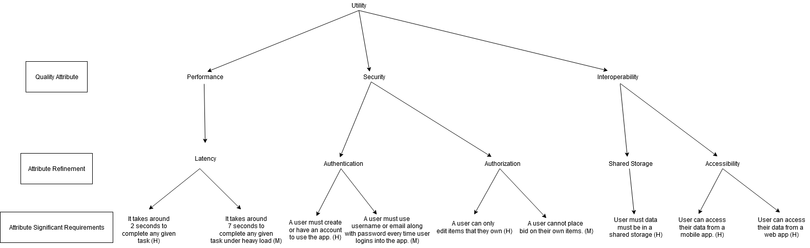

# 1. Concrete Quality Attribute Scenarios

### 1.1. The first scenario presents a risk. The system might not comply with the performance requirement, which specifies taking less than 1-second give to complete any task given.
### 1.2. The second scenario presents a risk. The system does not require email and a password, which can compromise the application's security.
### 1.3. The third scenario presents a trade-off. The possibility of login in just using the username can compromise the system security. But, provide usability of the application.
### 1.4. The fourth scenario presents non-risk. The user is forbidden to create empty items.
### 1.5. The fifth scenario presents non-risk. The user gets a confirmation of valid items.
### 1.6. The sixth scenario presents a sensitive point. The change from an external source can disagree with the user data. The data conflict may be analyzed and merged before being pushed.
### 1.7. The last scenario presets non-risk. The system can threat many requisitions at the same time by controlled access to data.

# 2. Utility Tree

